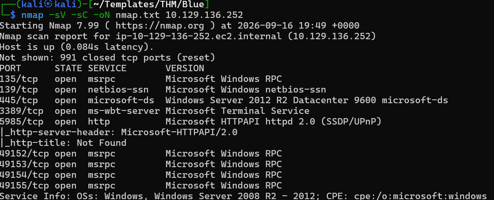
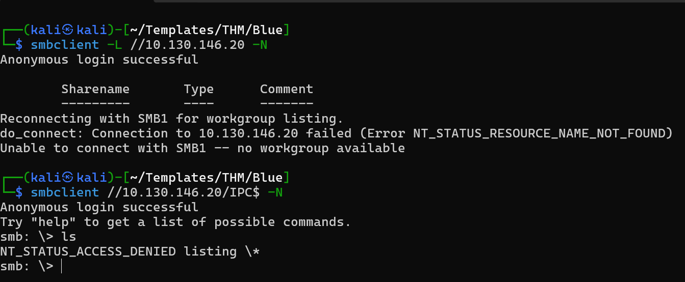
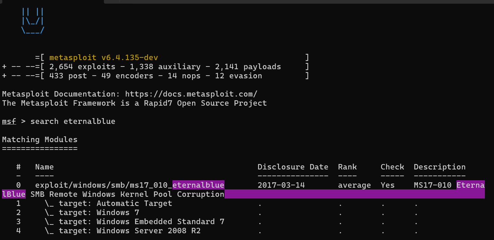

# Blue — Debrief

## Objective
What was the goal of the room?

## Initial Recon
My eyes first went to services were smb port 445 and the http running on port 5985




- Target: 10.129.136.252
- Open ports: 
    - 135 running msrpc
    - 139 running netbios-ssn
    - 445 running microsoft-ds - Our target who gonna wannacry 😜
    - 3389 running ms-wbt-server
    - 5983 running http - A viable target
- Services: 
    - Microsoft Windows RPC
    - Windows 2012 R2 Datacenter
    - Microsoft HTTPAPI httpd version 2.0
- Technologies: 
    - Samba running on port 445 is a high value target, it's mainly used as a file share service
    - HTTP possible a webserver but nothing too interesting
- Interesting endpoints/files:

## Attack Path

### 1. Enumeration
> **🕸️ I tried that service on port 5589:** My first instinct was to check out whatever was running on that http server, I hoped to find any interesting endpoints or hidden directories. My hopes were quickly crushed when it was a 404 bad request, I didn't even have time to pull out my bobuster gun 😈
> **🔍 Next was SMB running on 445:** Like every veteran in the field of computers, there are some exploits in the history of history that are just too cruel to forget. The target exposed smb running on port 445 so I tried to probe for answers that would lead to it's eventual downfall.
    - First, I communicated using smbclient on linux : 
    smbclient -L //<BLUE_IP>/ -N
    The -L is smbclient's way of saying "Hey, I want a list of all shares on the following target". While the -N attempts to do that while avoiding any passsword prompts along the way

### 2. Discovery
    - First off, http was a bust (obviously)
    - The SMB client on our target allowed for unathenticated access to the share but that was it, no strings(permissions attached)
    - As a good boy, mama always told me "Knowledge is power" so I knew that this smb help more than meets the eye so I did a quick google search using the server info of the service on port 445 gotten from the nmap scan from earlier "Windows Server 2012 R2 Datacenter 9600"

### 3. Exploitation
What did I do with that discovery?
    - From my google search from just before now, I could see many search results pointing to (you guessed it) MS17-010 aka EternalBlue aka WannaCry. So I went back to my terminal and used my trusty searchsploit to search for ms17-010: , surprisingly there was no result for wannacry 🤪. So I had to options: Option A. Mirror one of these exploits from exploitdb with `searchsploit -m /path/to/exploit` or Options B. Fire up the metasploit console with the `msfconsole` command
    - If you're extremely strongwilled and good at your coding, Option A works just fine but as for me and my household, Option B it is
    , We'll be making use of module with id 0 with the command use 0

### 4. Foothold
How did I get initial access?

### 5. Privilege Escalation
How did I move from the initial user to a higher-privileged user?

## Key Findings

| Finding | Evidence | Impact |
|---|---|---|
| <finding> | <what proved it> | <what it allowed> |

## Commands Worth Remembering

```bash
# only commands that were actually useful